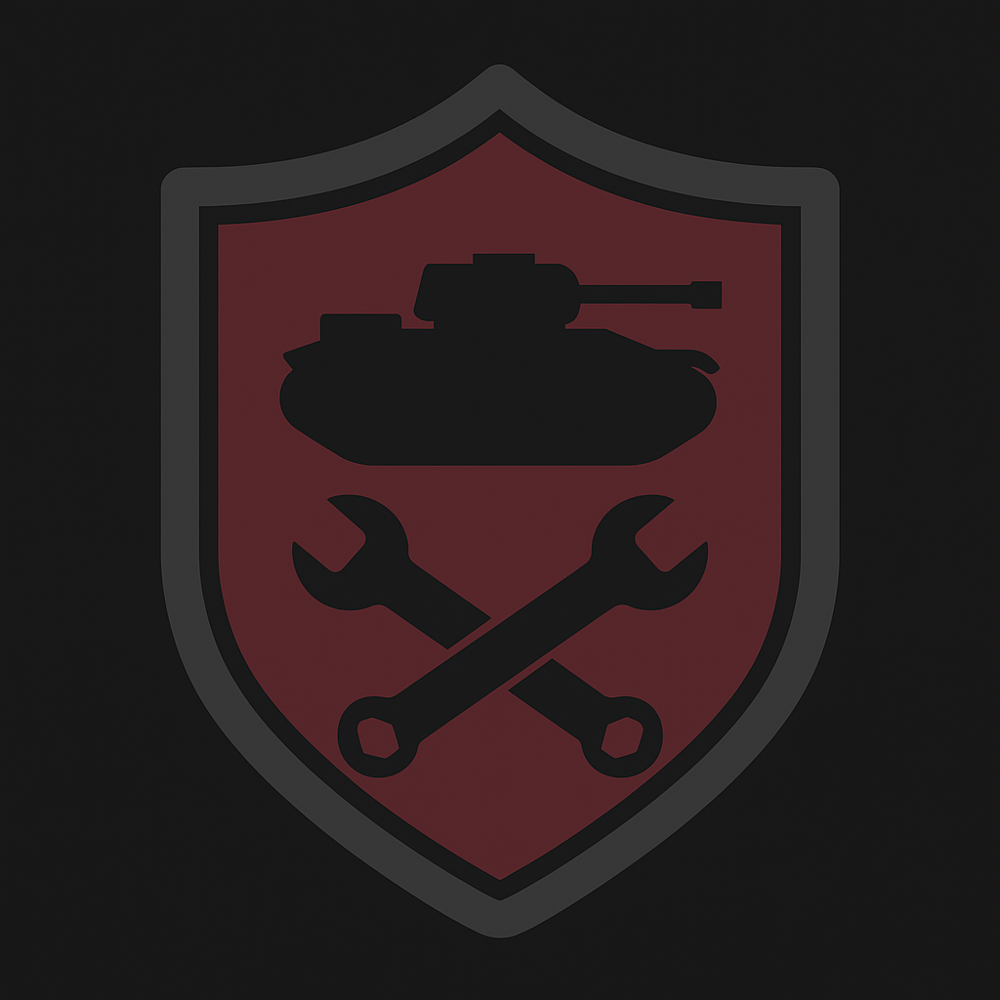

# Nishizumi Setups Sync



**Version 3.0.0** · [Download the latest release](https://github.com/nishizumi-maho/Nishizumi-Sync/releases/latest)

Imports iRacing setups from a supplier's archive or folder and keeps your
personal, team and per-driver folders synchronised — from a desktop interface,
from the command line, or quietly in the system tray.

---

## What it does

For every car folder inside your iRacing setups directory, the tool maintains
this structure:

```
<iRacing setups>/
└── ferrari296gt3/                 ← one folder per car, named by iRacing
    ├── Personal/                  ← your own copy (personal_folder)
    │   └── <supplier>/<season>/   ← what the import writes
    ├── Team/                      ← the team copy (team_folder)
    ├── Private/                   ← the sync source (sync_source)
    │   ├── Common Setups/         ← shared baseline, driver mode only
    │   └── Drivers/<name>/        ← one folder per driver
    └── Shared/                    ← the sync destination (sync_destination)
```

**Import** puts a supplier's setups into the personal and team folders.
**Sync** publishes the source folder into the destination folder, filling in each
driver's folder and falling back to *Common Setups* for drivers who have none.

Cars that share setups — the three NASCAR classes and the two Super Formula
SF23 variants — are kept identical automatically.

## Installing

Grab the executable from the [releases page](https://github.com/nishizumi-maho/Nishizumi-Sync/releases/latest)
and run it. Nothing else is required; it updates itself.

To run from source you need Python 3.9 or newer:

```bash
git clone https://github.com/nishizumi-maho/Nishizumi-Sync.git
cd Nishizumi-Sync
pip install -r requirements.txt
python nishizumi_setups_sync.py
```

Every dependency is optional and the application degrades gracefully:

| Package   | Needed for                     | Without it                                   |
|-----------|--------------------------------|----------------------------------------------|
| `PySide6` | the graphical interface        | the command line still works                 |
| `requests`| faster network calls           | falls back to the standard library           |
| `rarfile` | importing `.rar` archives      | `.zip` archives still import                 |

## First run

1. Start the application. Without arguments it opens the interface.
2. **Import tab** — pick your iRacing setups folder (usually
   `Documents\iRacing\setups`), choose whether you import from an archive, from
   a folder, or not at all, and fill in the four folder *names* (team, personal,
   supplier, season). These are names, not paths: they are created inside each
   car folder.
3. **Sync tab** — set the sync source (the folder you edit) and the sync
   destination (the folder you share). They must differ.
4. **Drivers tab** — optional. Enable per-driver folders and add drivers by
   hand, or let Garage 61 fetch the list of your team.
5. Press **Dry run** to see exactly what would happen, then **Run now**.

Settings are saved in `user_config.json` next to the application. If that folder
is read-only, everything moves to your user data directory instead; set
`NISHIZUMI_SYNC_HOME` to choose the location yourself.

## Command line

```bash
nishizumi-sync                       # open the interface (default)
nishizumi-sync run                   # import and sync using the saved settings
nishizumi-sync run --dry-run         # or: nishizumi-sync dry-run
nishizumi-sync import path/to/pack.zip
nishizumi-sync import setups/ --ask  # prompt for unrecognised car folders
nishizumi-sync tray                  # stay resident and sync on a timer
nishizumi-sync check-update
nishizumi-sync update --yes
nishizumi-sync config show|path|export FILE|reset
nishizumi-sync mapping list|set FOLDER CAR|remove FOLDER
```

Global flags: `--config PATH`, `--log-level DEBUG|INFO|WARN|ERROR`,
`--no-update-check`, `--version`.

Running from a checkout uses `python nishizumi_setups_sync.py <command>` or
`python -m nishizumi_sync <command>`. The 1.x flags `--silent`, `--gui` and
`--tray` still work.

On Windows, `pythonw.exe nishizumi_setups_sync.py run` runs without a console
window — put a shortcut to it in `shell:startup` and tick *"Run silently when
started without a console"* to sync at every login.

## Updates

The application checks GitHub Releases for a newer version, at most once every
24 hours by default, and offers to install it. You decide how it behaves in the
**Updates tab** or in the `updates` section of `user_config.json`:

```json
"updates": {
    "check_on_startup": true,
    "check_interval_hours": 24,
    "auto_install": false,
    "channel": "stable",
    "repository": "nishizumi-maho/Nishizumi-Sync"
}
```

- `channel` — `"stable"` or `"prerelease"`.
- `check_interval_hours` — `0` checks at every start.
- `auto_install` — download and install without asking.

Downloads are verified against the SHA-256 checksum published with the release.
How the update is applied depends on how you installed the program:

| Installation      | What happens                                                        |
|-------------------|---------------------------------------------------------------------|
| Release executable| The new build is downloaded, swapped in after the app exits, and restarted. |
| Source archive    | The `nishizumi_sync` package is replaced; restart the application.   |
| Git checkout      | You are told to `git pull` — your work is never overwritten.         |
| `pip install`     | You are told to `pip install --upgrade`.                             |

You can skip a version ("Skip this version") and it will not be offered again
until a newer one appears.

## Configuration reference

| Key | Meaning |
|-----|---------|
| `iracing_folder` | Full path to the iRacing setups folder |
| `source_type` | `zip`, `folder` or `none` |
| `zip_file` / `source_folder` | What to import, for the matching mode |
| `profiles` / `active_profile` | Named sets of team/personal/supplier/season names |
| `team_folder`, `personal_folder`, `supplier_folder`, `season_folder` | The active profile's folder names |
| `sync_source` / `sync_destination` | Folder names to copy from and to |
| `hash_algorithm` | `md5` or `sha256` for comparing files |
| `copy_all` | Copy every file type, not just `.sto` |
| `delete_extras` | Remove destination files that no longer exist in the source |
| `use_driver_folders` / `drivers` | Per-driver folders and the driver list |
| `use_garage61`, `garage61_team_id`, `garage61_api_key` | Garage 61 driver lookup |
| `use_external` / `extra_folders` | Folders from other tools to merge into the source |
| `backup_enabled`, `backup_before_folder`, `backup_after_folder` | Backups around each run |
| `enable_logging`, `log_file`, `log_level` | File logging |
| `run_on_startup`, `tray_mode`, `tray_interval` | Automation |
| `enable_plugins` | Run the `before_sync` / `after_sync` hooks |
| `updates` | See above |

The Garage 61 API key is stored in plain text — keep `user_config.json` private.

### Extra folders

Tools such as Garage 61 write into their own folder. Add them under
*Sync → Extra folders* so their setups join the sync:

- **Car root** — the folder sits next to `Personal`/`Team` (e.g. `<car>/Garage 61`).
  Its contents are merged into the sync source and the original is left alone.
- **Sync destination** — the folder sits inside the destination and works as an
  inbox: its contents are moved into the source and the folder is removed.

### Car mapping

Supplier folders such as `03 - Ferrari GT3` are matched to iRacing car folders
automatically, including group folders like `NASCAR Trucks`, which import into
every variant. Anything unrecognised is reported; the interface asks which car
it belongs to and remembers the answer in `custom_car_mapping.json`. Edit the
list under *Tools → Edit car mapping*, or with `nishizumi-sync mapping set`.

### Plugins

With `enable_plugins` on, `before_sync.py` and `after_sync.py` in the `plugins`
folder (next to `user_config.json`) are executed:

```python
# plugins/before_sync.py
def execute(config, logger):
    logger.info("about to sync %s", config["iracing_folder"])
```

They run with your permissions, which is why they are off by default.

## Building an executable

```bash
pip install -r requirements-dev.txt
python scripts/build_exe.py
```

The binary lands in `dist/` named `NishizumiSync-windows.exe`,
`NishizumiSync-linux` or `NishizumiSync-macos` — the naming the in-app updater
looks for. Pushing a `v*` tag runs the same build in CI and publishes the
release automatically.

## Development

```bash
pip install -r requirements-dev.txt
pytest -q
flake8 . --max-line-length=127 --max-complexity=15
```

Layout:

```
nishizumi_sync/
├── cli.py          command line entry point
├── config.py       loading, migration, profiles, atomic saves
├── cars.py         car aliases, groups, folder → car resolution
├── fileops.py      dry-run aware copy/delete primitives and statistics
├── sync.py         the synchronisation pipeline
├── importer.py     archive and folder import (with Zip Slip protection)
├── updater.py      GitHub release checks and installation
├── garage61.py     driver lookup
├── plugins.py      before_sync / after_sync hooks
├── http.py         requests, with a standard library fallback
├── logs.py         logging setup
├── paths.py        where configuration and data live
└── gui/            PySide6 interface, tray mode and worker threads
```

## Troubleshooting

**The interface does not open.** Install PySide6 (`pip install PySide6`). Without
it the command line still works.

**Nothing is imported.** Check the output panel: folders that cannot be matched
to a car are listed by name. Map them under *Tools → Edit car mapping*.

**RAR archives fail.** Install `rarfile` and an `unrar` binary, or extract the
archive yourself and import the folder.

**Update check fails.** GitHub rate-limits unauthenticated requests; set the
`GITHUB_TOKEN` environment variable, or wait and try again. Use
`--no-update-check` to skip it entirely.

**Something was deleted that should not have been.** Turn off *"Remove files in
the destination that no longer exist in the source"* in the Sync tab, and always
use **Dry run** first when changing folder names.

## License

MIT — see [LICENSE](LICENSE).
